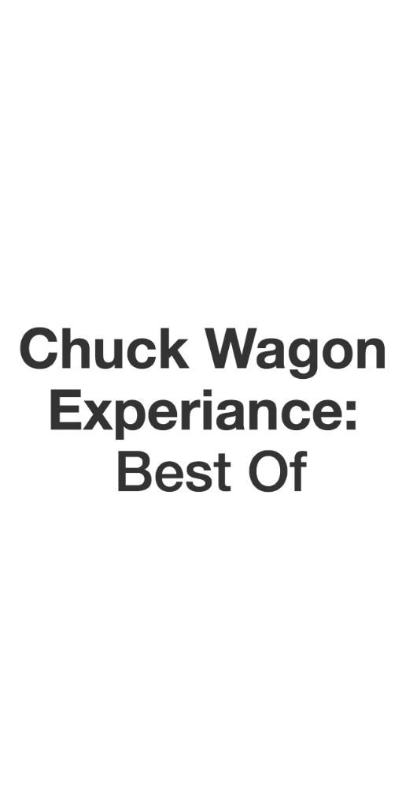
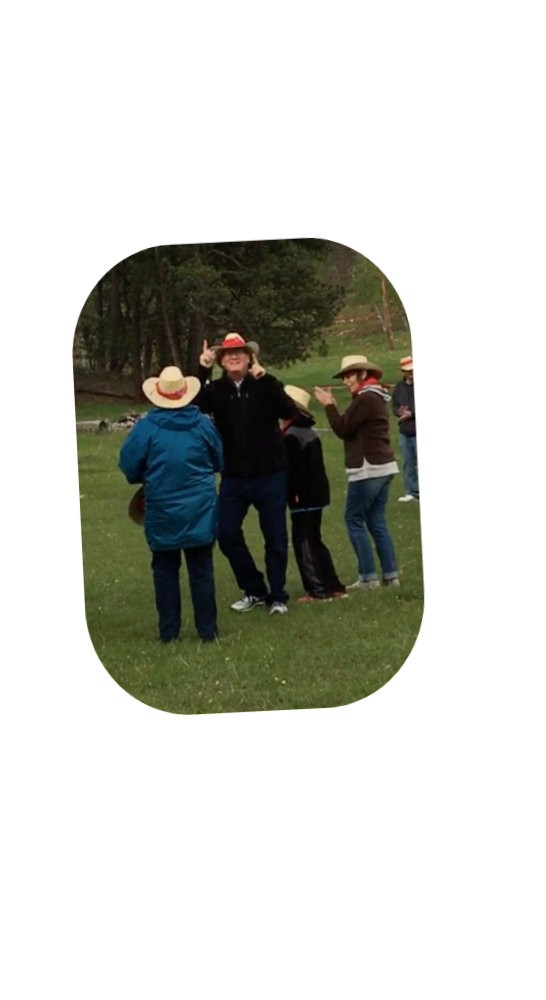
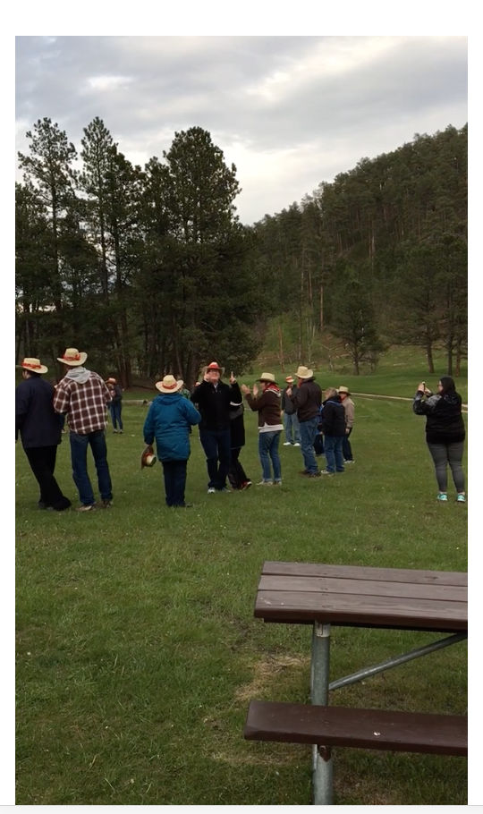

# Custer State Park Chuckwagon
#### Family trip over Memorial Weekend to South Dakota's Badlands, Mount Rushmore, Keystone and Custer State Park.  At Custer State Park we decided to do a fourwheeling tour through the park followed up with a chuckwagon dinner after.  After dinner, I caught my Father dancing and completely out of his comfort zone.  This is a tribute to that great experience!

###### Animated Heading:

###### Animated Picture:

###### Video Evidence Of The Dance:

---

## Technologies Used
  1. HTML / CSS / Javascript
  2. jQuery
  3. Bootstrap
  4. Animated CSS

#### Note: APP is designed for mobile view

###### App Can be Viewed at: https://hokey-pokey.herokuapp.com/

---

## License
##### Copyright 2017 Chris Stanton

###### Permission is hereby granted, free of charge, to any person obtaining a copy of this software and associated documentation files (the "Software"), to deal in the Software without restriction, including without limitation the rights to use, copy, modify, merge, publish, distribute, sublicense, and/or sell copies of the Software, and to permit persons to whom the Software is furnished to do so, subject to the following conditions:

###### The above copyright notice and this permission notice shall be included in all copies or substantial portions of the Software.

###### THE SOFTWARE IS PROVIDED "AS IS", WITHOUT WARRANTY OF ANY KIND, EXPRESS OR IMPLIED, INCLUDING BUT NOT LIMITED TO THE WARRANTIES OF MERCHANTABILITY, FITNESS FOR A PARTICULAR PURPOSE AND NONINFRINGEMENT. IN NO EVENT SHALL THE AUTHORS OR COPYRIGHT HOLDERS BE LIABLE FOR ANY CLAIM, DAMAGES OR OTHER LIABILITY, WHETHER IN AN ACTION OF CONTRACT, TORT OR OTHERWISE, ARISING FROM, OUT OF OR IN CONNECTION WITH THE SOFTWARE OR THE USE OR OTHER DEALINGS IN THE SOFTWARE.
